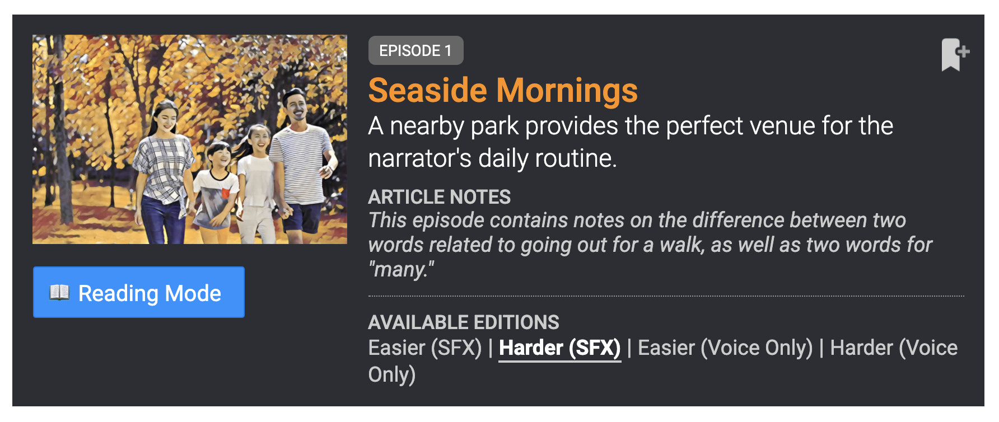
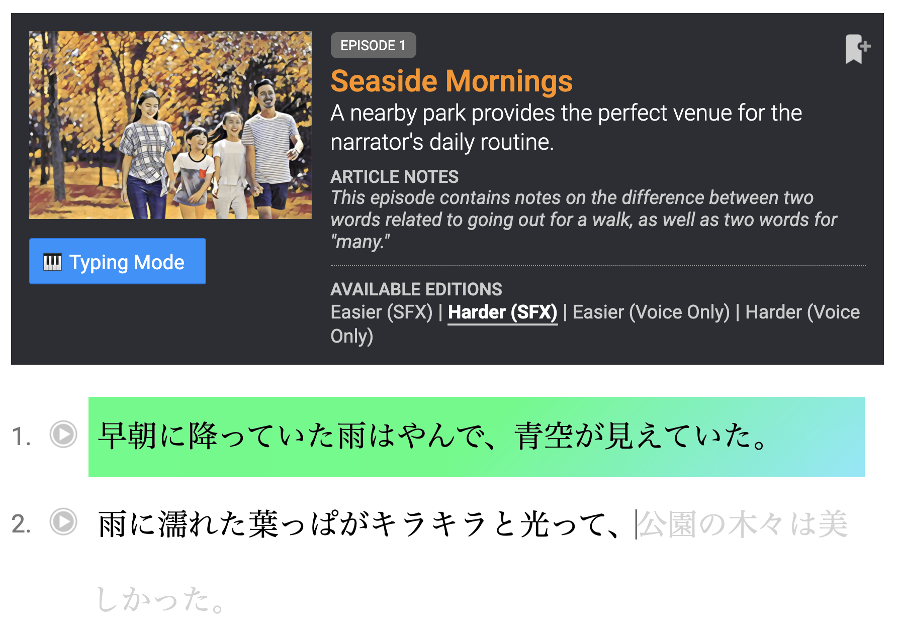

#  Satori Typer

Satori Typer is a Chrome Extension that makes it easy for you to type and practice materials on [Satori Reader](https://www.satorireader.com/). After installation, click the `Reading Mode` / `Typing Mode` button in any episode to switch between the two modes.

- Enchance your Japanese through typing, sentence by sentence.
- Sentence auto-play helps you type by ear.
- Data only saved on Local Storage (changing browsers or computers will result in loss of progress).

